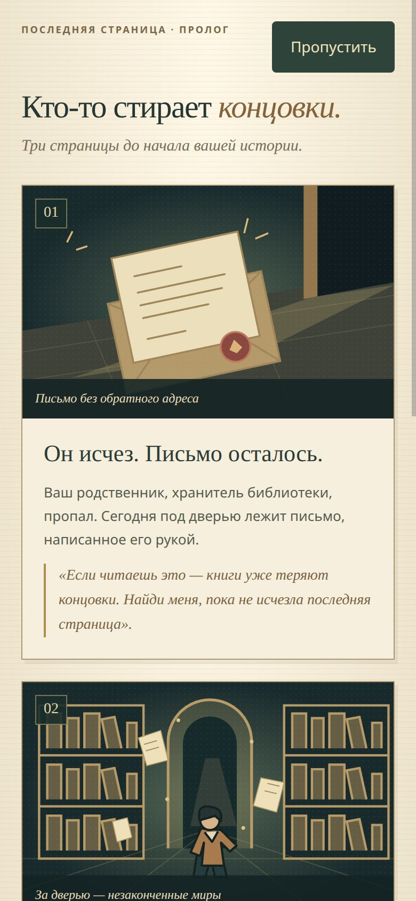
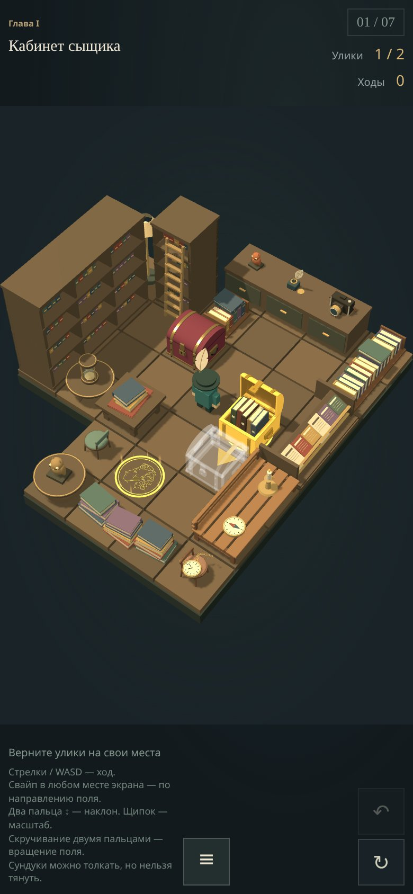
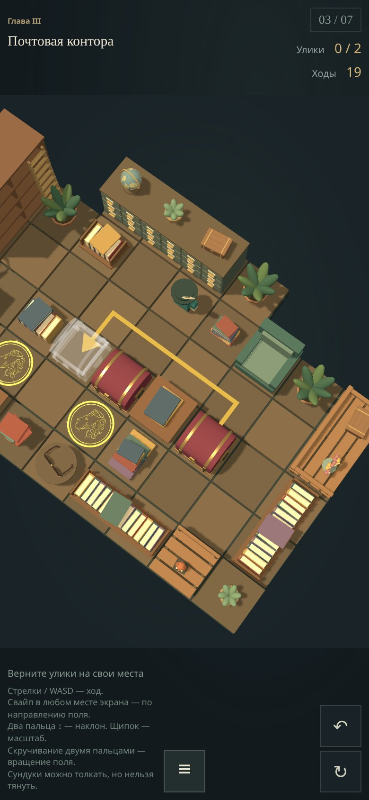
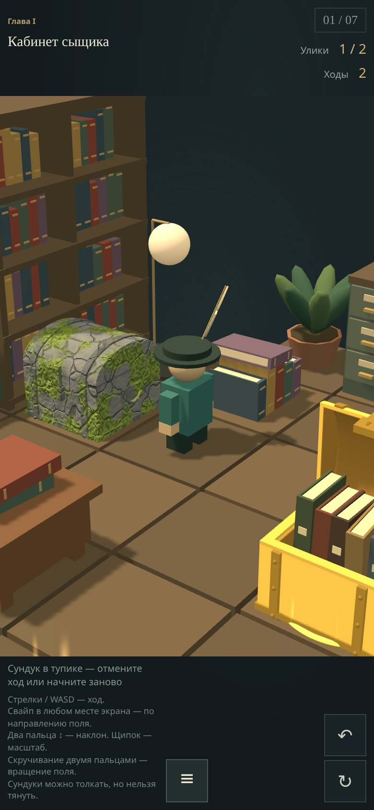
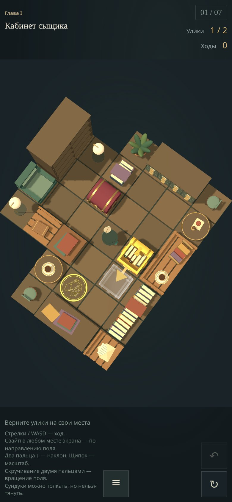
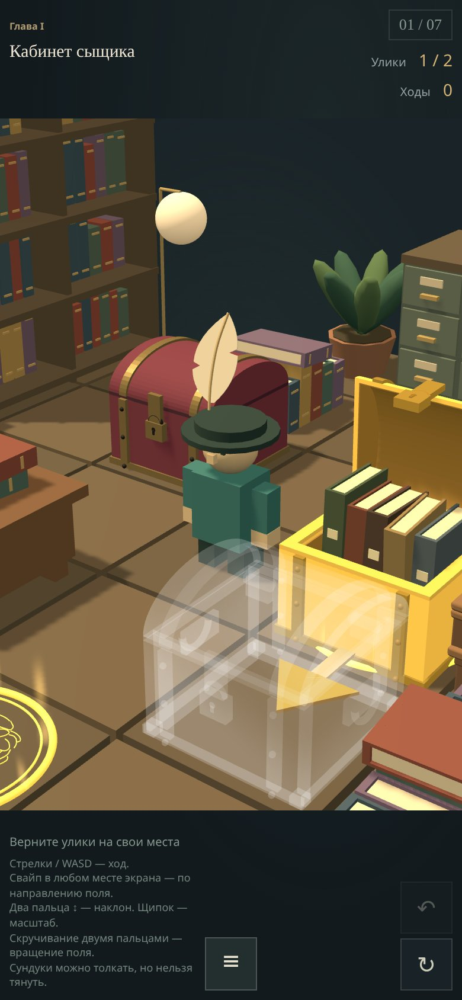
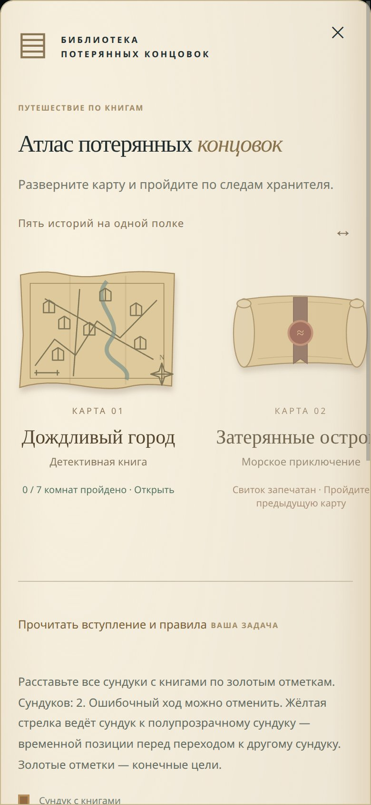
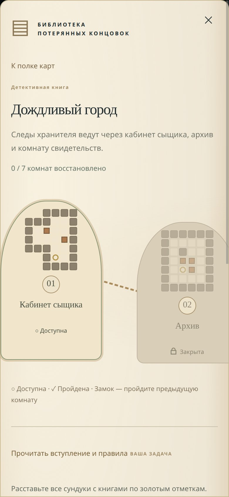
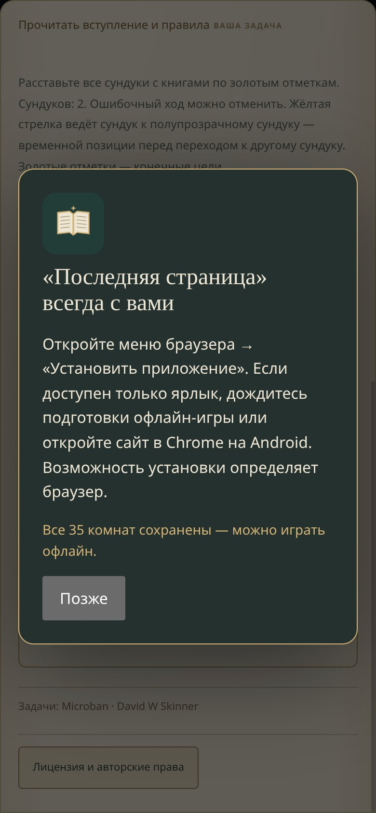

# Последняя страница

### Кто-то стирает концовки. Следующий ход — ваш.

**The Last Page** — готовая браузерная 3D-головоломка о библиотеке потерянных концовок. Пять книжных миров, 35 комнат и сундуки, которые нужно вернуть на свои места. Откройте игру на телефоне или компьютере — или установите её как приложение и возьмите всю библиотеку с собой.

**[▶ Играть в «Последнюю страницу»](https://dmitry-titarchuk.github.io/the-last-page/)**

**35 головоломок · 5 карт · 3D · управление жестами · сохранение прогресса · игра офлайн**

## Библиотека ждёт своего героя

Ваш родственник, хранитель библиотеки, исчез. Под дверью осталось письмо, написанное его рукой:

> «Если читаешь это — книги уже теряют концовки. Найди меня, пока не исчезла последняя страница».

Сыщик не успел назвать преступника. Корабль не вернулся в порт. Истории застыли на полуслове, а между полок кто-то шепчет ваше имя. Чтобы пройти по следам хранителя, придётся войти в книги и решить головоломки их комнат.

Первые шаги — вступительный комикс и кабинет сыщика. На поле видны золотые отметки, сундуки с книгами и подсказка для первого толчка. Дальше всё зависит от вашего решения.

<table>
  <tr>
    <th>Письмо, с которого всё начинается</th>
    <th>Первая комната: кабинет сыщика</th>
  </tr>
  <tr>
    <td></td>
    <td></td>
  </tr>
</table>

## Простые правила. Ходы, над которыми придётся подумать

Поставьте **все сундуки с книгами на золотые отметки**. Герой движется по клеткам и толкает только один сундук за раз. Тянуть сундуки нельзя: угол без отметки может стать ловушкой. Здесь полезно думать на несколько шагов вперёд.

Ошибочный ход можно отменить, а комнату — начать заново. После решения герой празднует победу, и открывается следующая головоломка.

| Действие | На телефоне | На компьютере |
| --- | --- | --- |
| Шаг или толчок | Свайп по направлению поля | Стрелки / WASD |
| Отмена хода | «Отменить» | Z или «Отменить» |
| Начать комнату сначала | «Заново» | «Заново» |
| Наклон камеры | Два пальца вверх и вниз | Перетаскивание мышью |
| Масштаб и вращение поля | Щипок и поворот двумя пальцами | — |
| Карты и комнаты | «Меню» | «Меню» |

**Вызов юным читателям:** считаете себя гениальным сыщиком? Попробуйте восстановить первую карту — семь комнат без потерянных сундуков. А потом предложите родителям решить ту же задачу за меньшее число ходов. Книги здесь открываются тем, кто умеет замечать детали и искать выход.

## Подсказки, которые видно прямо на поле

**В первых трёх комнатах работает система наглядных подсказок.** Жёлтая стрелка показывает, куда перемещать выбранный сундук, а полупрозрачный **сундук-призрак** отмечает позицию, к которой нужно его привести на текущем этапе решения. Это может быть промежуточная клетка: иногда сначала нужно освободить проход для другого сундука. Золотые отметки остаются конечными целями.

Подсказка учитывает текущее положение героя и сундуков и пересчитывается после хода. Она помогает увидеть следующий этап, оставляя игроку возможность самому разобраться, как обойти сундук и с какой стороны его толкнуть. С четвёртой комнаты этот помощник уступает место самостоятельному решению.

**Тупики тоже получают свой облик.** Сундук в обнаруженной безвыходной позиции превращается в каменный: на поверхности появляются трещины, а при неподвижной блокировке — мох. Вместе с этим игра предлагает отменить ход или начать комнату заново. Отмена возвращает прежнее состояние и обычный вид сундука — ошибку можно исправить, а не просто прочитать о ней.

<table>
  <tr>
    <th>Подсказка: маршрут с двумя поворотами</th>
    <th>Тупик: сундук превращается в камень</th>
  </tr>
  <tr>
    <td></td>
    <td></td>
  </tr>
</table>

## От обзора лабиринта до героя крупным планом

**Посмотрите на комнату сверху**, чтобы оценить проходы, положение сундуков и путь к целям. Затем опустите камеру и увеличьте масштаб **до ×3**, чтобы рассмотреть героя, книги и предметы вблизи. При приближении камера следует за героем. Один и тот же игровой мир удобен и для планирования ходов, и для рассматривания деталей.

На телефоне наклон меняется движением двух пальцев вверх и вниз, масштаб — щипком, а поворот поля — вращением двух пальцев.

<table>
  <tr>
    <th>Вид сверху: весь лабиринт перед глазами</th>
    <th>Масштаб ×3: герой и сундук-призрак</th>
  </tr>
  <tr>
    <td></td>
    <td></td>
  </tr>
</table>

## Пять миров на одной полке

Меню оформлено как **атлас потерянных концовок**. Карты лежат на полке, будущие миры скрыты в запечатанных свитках, а комнаты соединены дорожкой. Миниатюры показывают настоящие схемы лабиринтов: стены, сундуки и цели.

| Карта | Книжный мир |
| --- | --- |
| Дождливый город | Детективная книга: кабинеты, архивы и следы хранителя |
| Затерянные острова | Морское приключение: порт, острова и затонувшие залы |
| Зеркальный замок | Готическая сказка: зеркала и тайны прежнего финала |
| Незаконченные страницы | Забытый роман: мир из обрывков текста |
| Запретный раздел | Библиотека: забытые книги и последний след хранителя |

На каждой карте семь комнат. Пройдите их, чтобы открыть следующую карту; к решённым задачам можно возвращаться. Головоломки взяты из коллекции **Microban Дэвида Скиннера**. Сюжетная завязка представлена в прологе; текущее прохождение строится вокруг решения комнат.

<table>
  <tr>
    <th>Полка карт и запечатанные миры</th>
    <th>Маршрут со схемами лабиринтов</th>
  </tr>
  <tr>
    <td></td>
    <td></td>
  </tr>
</table>

## Установите игру — библиотека будет под рукой

«Последняя страница» — **PWA**, веб-приложение, которое можно установить прямо из браузера. Начать можно [по ссылке](https://dmitry-titarchuk.github.io/the-last-page/), а затем добавить игру на главный экран.

- **Свой значок и отдельное окно.** Запускайте игру как приложение, без поиска вкладки и адресной строки.
- **Все 35 комнат без интернета.** После первой загрузки можно играть в дороге или там, где нет связи.
- **Продолжение с того же хода.** Текущая комната, положение сундуков, история отмены и прохождение сохраняются автоматически на этом устройстве.
- **Управление пальцами.** Свайп для хода, два пальца для наклона, щипок для масштаба и поворот для вращения поля.
- **Обновления через интернет.** Новые версии загружаются в фоне; во время партии обновление можно применить через меню с восстановлением игры.

**Как установить:** откройте игру на телефоне. На Android воспользуйтесь предложением в игре или пунктом «Установить приложение» в меню браузера. На iPhone откройте игру в Safari и выберите «Поделиться» → «На экран Домой». Способ установки зависит от браузера.

Перед игрой без связи дождитесь сообщения **«Все 35 комнат сохранены — можно играть офлайн»** в меню. Сохранения хранятся локально: очистка данных сайта удалит их.

<p></p>

*Все девять скриншотов сняты с опубликованной игры в мобильном режиме браузера.*

## Что реализовано с помощью ИИ-инструментов

Проект показывает результат разработки с ИИ: от игровой идеи до опубликованного приложения, которое можно открыть, установить и пройти. Объём работы виден в нескольких связанных частях:

| Часть проекта | Готовый результат |
| --- | --- |
| Игровая логика | Движение и толкание сундуков, проверка победы, отмена ходов, перезапуск, поиск подсказок, обнаружение тупиков и последовательное открытие 35 комнат |
| Визуальная часть | 3D-сцены на Three.js, модели мебели и предметов, анимации героя, камера с приближением ×3, стрелки и сундуки-призраки, превращение сундуков в камень |
| Подача и навигация | Иллюстрированный пролог, единый книжный стиль, полка карт и маршруты с миниатюрами уровней |
| Работа на телефоне | Адаптивный интерфейс, сенсорные жесты и установка как PWA |
| Сохранения и офлайн | Восстановление партии вместе с отменой ходов, кеширование всей игры и обновления приложения |
| Проверка качества | [Автоматические тесты](tests/) игровой логики, сохранений, навигации и PWA; проверка решаемости уровней |

**[Открыть игру и принять вызов →](https://dmitry-titarchuk.github.io/the-last-page/)**

## Локальный запуск

Нужны Node.js 22 или новее и браузер с WebGL 2. В каталоге проекта:

```sh
npm ci
npm run dev
```

Откройте [http://127.0.0.1:5173](http://127.0.0.1:5173). Запускать игру нужно через сервер, а не двойным кликом по `index.html`.

## Лицензия

Авторский код и собственные материалы — [PolyForm Noncommercial 1.0.0](LICENSE). Автор: **Dmitry Titarchuk**. Уведомление об авторских правах: [NOTICE](NOTICE). Для коммерческого использования вне условий лицензии требуется отдельное разрешение автора: [dmitry.titarchuk@gmail.com](mailto:dmitry.titarchuk@gmail.com).

Three.js и схемы уровней Microban имеют отдельные условия использования; сведения об авторах, лицензиях и статусе разрешений приведены в [THIRD_PARTY_NOTICES.txt](THIRD_PARTY_NOTICES.txt).
